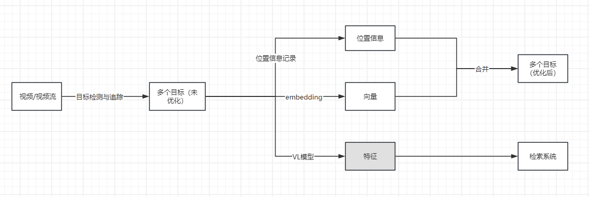

# 视频追踪方案

### 0 背景

随着计算机视觉与人工智能技术的快速发展，视频追踪（Video Tracking）已成为智能监控、无人系统、交通管理、安防等领域的重要基础能力。视频追踪的核心目标是从连续的视频流中，对目标对象（如人、车辆、无人机、动物等）进行持续检测与位置更新，保证在复杂环境下目标的身份一致性和轨迹连贯性。

虽然视频追踪技术发展迅速，但在真实复杂环境中仍不算完全成熟，主要挑战包括：

1. **目标遮挡与丢失**  
   - 人群密集或车辆拥堵时容易丢失目标。  
   - 目标消失再出现时难以保持身份一致性。  

2. **光照与环境变化**  
   - 白天/夜晚切换、阴影、灯光闪烁影响检测稳定性。  
   - 雨雪、雾霾等天气降低鲁棒性。  

3. **多目标跟踪复杂度高**  
   - 目标数量多、形态相似时，容易出现 ID Switch。  
   - 跨摄像头的目标关联仍然是难点。  

4. **实时性与算力限制**  
   - 高分辨率、多摄像头场景下实时处理需要强大算力。  
   - 在无人机、边缘设备上运行仍受限于功耗与模型轻量化。  

5. **隐私与合规问题**  
   - 公共场所的应用涉及隐私保护与法律合规。

现阶段，英伟达有一套基于多路摄像头追踪+数字孪生的方案，但是这个方案不开源，并且摄像头是固定摄像头，且不适合开放世界场景。  

### 1 提出的方案

#### 1.1 单摄像头遮挡问题

CLIP（Contrastive Language–Image Pretraining）是 OpenAI 提出的多模态模型，能够同时理解图像和文本。它将图像和文本映射到同一个向量空间，使得语义相关的图像和文本在向量空间中距离更近，从而实现通用的相似度比对。通过将图像编码为向量表示，可以使用余弦相似度等度量方法计算两张图像之间的相似性。CLIP 的应用场景非常广泛，包括图像检索、去重检测、内容推荐以及跨模态比对（例如文字描述到相似图片的检索）。其优势在于通用性强、不依赖具体分类任务、能够处理多种类型的图像，并且具备跨模态能力，无需手工特征设计即可获得语义向量。但它对小细节差异的敏感度有限，对于特定领域如医疗或工业缺陷可能需要微调，同时在高分辨率或大规模图库比对时计算资源需求较高。

单摄像头下，最大的问题在于多个对象遮挡问题，传统的视频目标追踪方法，大多数能够做到少数帧缺失下的持续对齐，但是一旦目标由于算法精度（开放世界下，行人追踪等相对来说精度很高，但是特定的别的环境下，很容易丢失）和遮挡等问题，极易出现多帧丢失。

所以我的方案是在传统的视频目标追踪方法上，加入一个持续进行特征提取的机制，作为多个目标相似度判定的依据；同时，综合时间序列以及空间信息，设置了一个关于时间和空间距离的函数（单位时间内最多移动多少像素），作为对目标进行匹配的判断依据。

#### 1.2 单摄像头的对象检索

现在有很多视频处理模型，但是实际操作起来，还是有很多问题，一个是显存占用大，另一个就是很难从视频（流）中得到准确的目标时间信息和空间信息。这里，在上一个问题的基础上，提出一种思路：

> 视频中一个对象，从第一帧出现，到最后一帧离开监控区域，是一个完整的周期，可以通过模型对这个周期内的同一个对象进行高维的特征提取，比如：
> 性别：男 / 女 / 未知  
> 发型：长发 / 短发 / 光头 / 其他 / 未知  
> 发色：黑色 / 棕色 / 黄色 / 白色 / 灰色 / 其他 / 未知  
> 上身：<颜色><类型> 或 未知  
> 下身：<颜色><类型> 或 未知  
> 鞋子：<颜色><类型> 或 未知  
> 配饰：<按“颜色+类型”列举；无则写“无”>  
> 特殊动作或状态：<列举；无则写“无”> 

这些高维特征，可以作为检索依据，进行检索。

#### 1.3 多摄像头的对象检索

在上面的解决方案之上，考虑多摄像头的问题。但是多摄像头对象检索，最好是先选择一个基准的摄像头，比如人员跟踪任务，先通过单个摄像头本身的检索结果，获取人员的人脸作为精确检索的依据，然后再拓展到其他摄像头。这样可以减少检索出来对象的数量，提升检索效率。